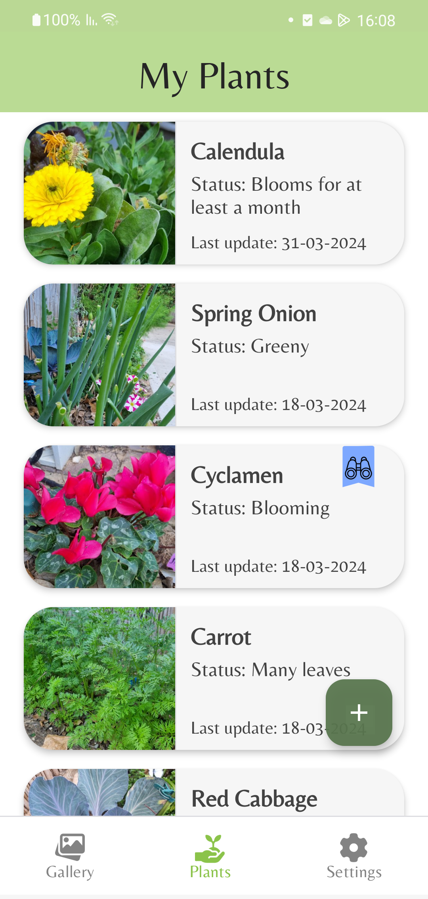
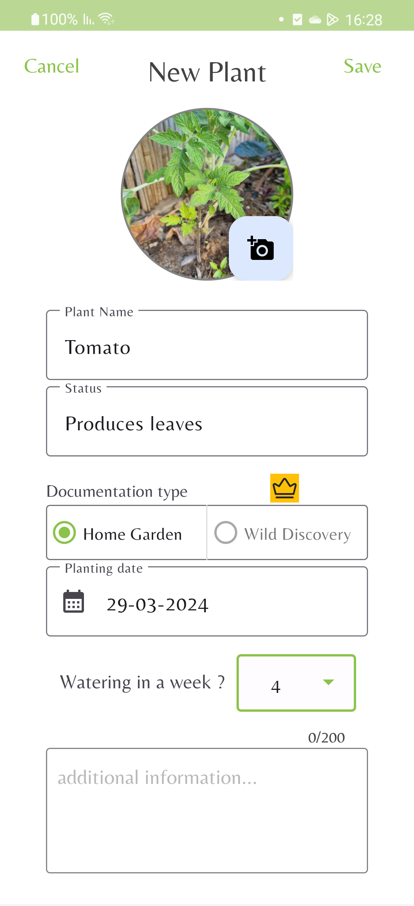
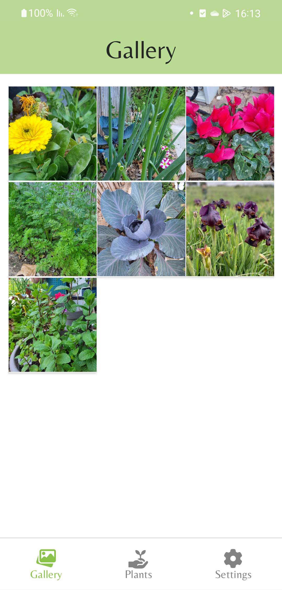

# NatureDiary

**NatureDiary** is a personal nature journaling app developed in **Java** using **Android Studio**. 
The app allows users to capture record and edit their nature experiences with photos, notes, and location data.

## 📸 Screenshots

<p align="start">
   
</p>  

<p align="center">
   
</p>

<p align="center">
   
</p>

<p align="center">
   
</p>

## ✨ Features

- 📷 Capture photos from camera or gallery  
- 📝 Write detailed notes for each observation  
- 🌙🔆 Dark and light theme
- 🎉 costumize popUp dialogs
- ⏰ Log automatic timestamps
- ☁️ Analytics and crashlytics integration with Firebase for possible future data addition and project control

## 🚀 Getting Started

To run this project locally:

1. **Clone the repository:**
   ```bash
   git clone https://github.com/TalBar4444/NatureDiary.git
   

## Credits
Icon made by Flat Icons (www.flat-icons.com) from www.flaticon.com
