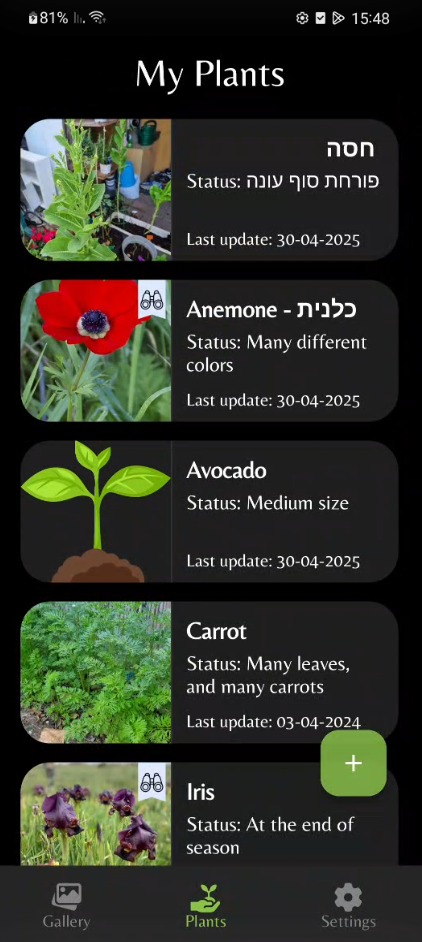

# NatureDiary

**NatureDiary** is a personal nature journaling app developed in **Java** using **Android Studio**. 
The app allows users to capture record and edit their nature experiences with photos, notes, and location data.

## 📸 Screenshots

<p align="start">
   <kbd></kbd>
</p>  

<p align="start">
   <kbd></kbd>
</p>

<p align="start">
   <kbd></kbd>
</p>

<p align="start">
   <kbd></kbd>
</p>

## ✨ Features

- 📷 Capture photos from camera or gallery  
- 📝 Write detailed notes for each observation  
- 🌙🔆 Dark and light theme
- 🎉 costumize popUp dialogs
- ⏰ Log automatic timestamps
- ☁️ Analytics and crashlytics integration with Firebase for possible future data addition and project control

## 🚀 Getting Started

To run this project locally:

1. **Clone the repository:**
   ```bash
   git clone https://github.com/TalBar4444/NatureDiary.git

## 📄 License
Copyright 2025 Tal Bar

Licensed under the Apache License, Version 2.0 (the "License"); you may not use this file except in compliance with the License. You may obtain a copy of the License at

http://www.apache.org/licenses/LICENSE-2.0

Unless required by applicable law or agreed to in writing, software distributed under the License is distributed on an "AS IS" BASIS, WITHOUT WARRANTIES OR CONDITIONS OF ANY KIND, either express or implied. See the License for the specific language governing permissions and limitations under the License.   

## Credits
Icon made by Flat Icons (www.flat-icons.com) from www.flaticon.com
